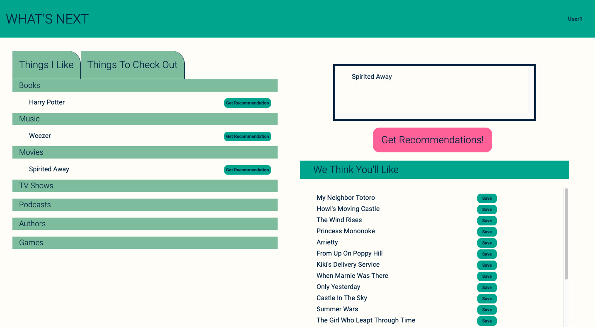
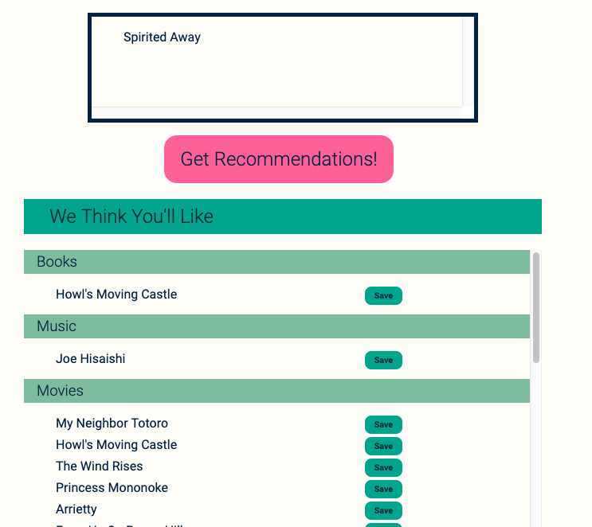
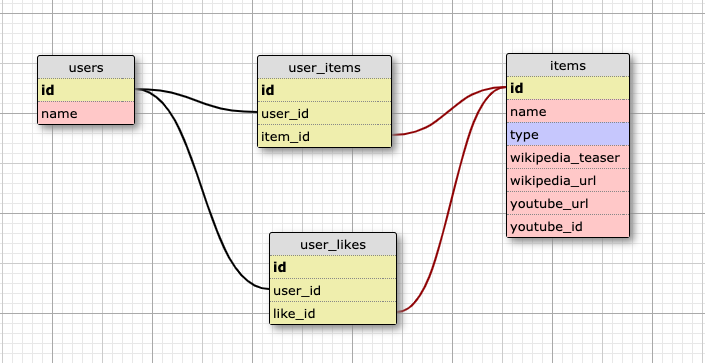

# What's Next?
What's Next is a solo project for Module 4 of the [Back-End Engineering Program](https://turing.io/programs/back-end-engineering/) at the [Turing School of Software & Design](https://turing.io/). The project specifications can be found [here](http://backend.turing.io/module4/projects/take_home_challenge/take_home_challenge_spec). I was tasked with creating a recommendations app using the [TasteDive API](https://tastedive.com/read/api). 

You can access the project in production here! [What's Next](https://quiet-cove-38152.herokuapp.com/) 

Please use `User1` as a username and `password` as the password until authentication is fully deployed. 

The project board is available [here](https://github.com/asmolentzov/whats-next/projects/1).



## Features
What's Next users can add movies, books, music, TV shows, podcasts, authors, or games to their "Things I Like". When they want to see some recommendations on things that might be similar, they can add an item to the Get Recommendations box and click to Get Recommendations! 20 items that are related to the chosen items are displayed.



A user can then save those recommendations to their "Things To Check Out" section, giving them a list of things to check out in the future! 

What's Next is [deployed on Heroku](https://quiet-cove-38152.herokuapp.com/) and uses [CircleCI](https://circleci.com/gh/asmolentzov/whats-next) for continuous integration.

## Schema Design
The schema is based on the `users` and the `items` tables. There are two joins tables: `user_items` and `user_likes`. This is so that items that a user has said they have read or watched and like are saved as `user_items`, while items that a user is interested in and want to save as a "Thing To Check Out" are saved as `user_likes`. 


## Installing Locally
### Initial Setup
To install this project on your local machine:
1. Clone the repo to your machine: 
```
git clone git@github.com:asmolentzov/whats-next.git
```
2. Change into the new directory.
3. Run bundle to install gems:
```
bundle install
```
4. Set up the database:
```
rake db:create
rake db:migrate
rake db:seed
```

### Setting up Environment Variables
You will need an API key from [TasteDive](https://tastedive.com/read/api). Once you have an API key, install Figaro:
```
figaro install
```
This will create a `config/application.yml` file for you. In that file, enter the following:
```
TASTEDIVE_API_KEY: <your API key here>
```

### Testing
What's Next is tested using RSpec and Capybara with Selenium Webdrivers. To run the test suite, after the set-up above, run the following: 
```
bundle exec rspec
```
Green means passing tests, red means failing. 

### Running the Server Locally
To run the code locally, use the following command to start the development server: 
```
rails s
```
Once running, point your browser to: 
```
http://localhost:3000/
```
And log in using the user from the seed data.

## How to Contribute
If you wish to contribute to this repo, you are welcome to make a PR and I would be happy to review it. 

## Built With
* [Ruby 2.4.5](https://ruby-doc.org/core-2.4.5/)
* [Rails 5.2.3](https://guides.rubyonrails.org/)
* [Faraday](https://github.com/lostisland/faraday)
* [JavaScript](https://www.javascript.com/)
* [jQuery](https://jquery.com/)
* [RSpec](http://rspec.info/)
* [Capybara](https://github.com/teamcapybara/capybara/blob/3.12_stable/README.md)
* [vcr](https://github.com/vcr/vcr)
* [selenium-webdriver](https://www.seleniumhq.org/projects/webdriver)
* [webdrivers](https://github.com/titusfortner/webdrivers)
* [CircleCI](https://circleci.com/gh/asmolentzov/whats-next)
* [Heroku](https://heroku.com/)
* [TasteDive API](https://tastedive.com/read/api)
* [GitHub Projects for Project Management](https://help.github.com/articles/about-project-boards/)

## Core Contributor
**[Anna Smolentzov](https://github.com/asmolentzov)**